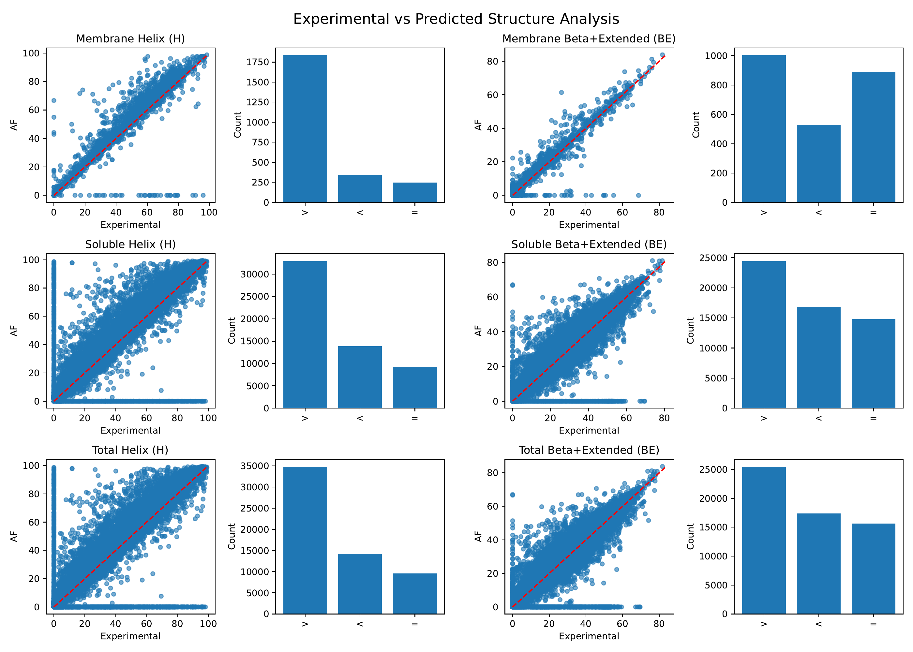

# pdb_af

Compare structures deposited in the PDB with AlphaFold2 predictions.

## Create Conda Environment
```bash
conda env create -f environment.yml
conda activate pdb_af_env
```

## Build Database

Create a local database of PDB and AlphaFold structures by downloading entries and mapping them to UniProt IDs:

```python
python build_db.py -o <DB_DIR>
```
#### Output directory structure:
```
<DB_DIR>
├── PDB
│   └─ … downloaded mmCIF/PDB files for each chain
├── AlphaFold
│   └─ … AlphaFold2 `.pdb` files for each UniProt ID
└── all_chain_pdb_info.csv
    └─ mapping of PDB chains to UniProt IDs and sequence lengths
```
⚠️ **warning:** The database is ~500GB in size.

## Compare Secondary‐Structure Percentages
Analyze and compare secondary structure percentages between experimental and predicted models:  
```python
python compare_ss.py -d <DB_DIR>
```
#### Outputs:
```
.
├── ss_comparison_allchains.csv  # Secondary‐structure percentages for each chain
└── exp_vs_af_ss.pdf             # Comparison plot (α-helix vs. β-sheet/extended)
```

*Results from May 7, 2025*  
  •	Row 1: Membrane proteins  
	•	Row 2: Soluble proteins  
	•	Row 3: All proteins  
	•	Columns 1–2: α-helix content (experimental vs. AF)  
	•	Columns 3–4: β-sheet/extended content (experimental vs. AF)  
	•	Bar charts:  
	$\qquad$•	>  More secondary structure in AlphaFold predictions  
	$\qquad$•	<  More in experimental structures  
	$\qquad$•	=  Equal content  
	$\qquad$•	Bar height = number of chains  
